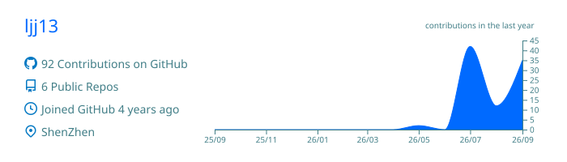
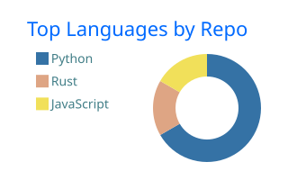
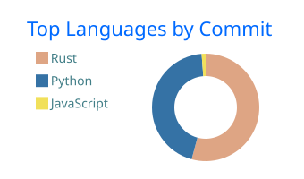
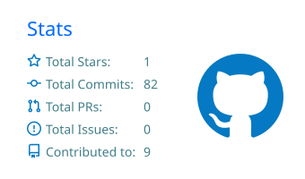
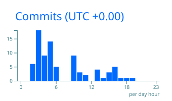
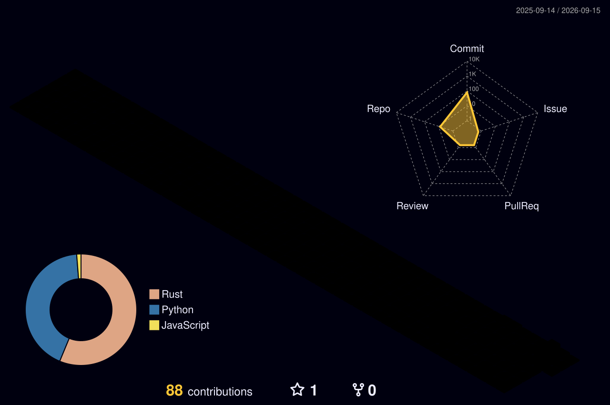

# FogPurification

**从一份好奇心出发，做点有趣，也做点真正有用的东西。**

  
  
  

---

## 01 / ABOUT

- 🎓 深圳大学 · 电子信息工程
- ⚡ 关注 **嵌入式系统、硬件 / 软件协同与 Linux**
- 🔧 喜欢折腾 **MCU、开发板、网络和实用工具**
- 🧪 从 PCB / MCU 到 Embedded Linux，把想法做成真正能跑的东西

> Building things from PCB to Linux.  
> Exploring the boundary between hardware and software.

---

## 02 / TECH STACK

 
 

---

## 03 / PROJECT LAB

<table>
<tr>
<td width="50%">

### 🧩 [EAIDK-310](https://github.com/ljj13/EAIDK-310)

Embedded Linux / board bring-up / RK3328 experiments.

</td>
<td width="50%">

### 🧰 [WeKit](https://github.com/ljj13/WeKit)

A WeChat-related toolkit project and customization playground.

</td>
</tr>

<tr>
<td width="50%">

### ⚡ [SZU-electricity-reporter](https://github.com/ljj13/SZU-electricity-reporter)

Practical campus electricity reporting / automation tool.

</td>
<td width="50%">

### 🌐 [SZU-Network-Connecter-Plus](https://github.com/ljj13/SZU-Network-Connecter-Plus)

Campus network connection helper and utility tooling.

</td>
</tr>

<tr>
<td width="50%">

### 📝 [VedioNotes](https://github.com/ljj13/VedioNotes)

Utilities around video notes and content workflows.

</td>
<td width="50%">

### 🔓 [WeChat-Channels-Video-File-Decryption](https://github.com/ljj13/WeChat-Channels-Video-File-Decryption)

Tooling for working with WeChat Channels video files.

</td>
</tr>
</table>

---

## 04 / GITHUB OVERVIEW

### Profile Summary

---

## 05 / ACTIVITY

 

---

## 06 / METRICS

---

## 07 / CONTRIBUTION SNAKE

<picture>
  <source media="(prefers-color-scheme: dark)" srcset="https://raw.githubusercontent.com/ljj13/ljj13/output/github-contribution-grid-snake-dark.svg">
  <source media="(prefers-color-scheme: light)" srcset="https://raw.githubusercontent.com/ljj13/ljj13/output/github-contribution-grid-snake.svg">
  
</picture>

---

## 08 / 3D CONTRIBUTIONS

---

`C / C++ / Python` · `STM32` · `Embedded Linux` · `Hardware × Software`

